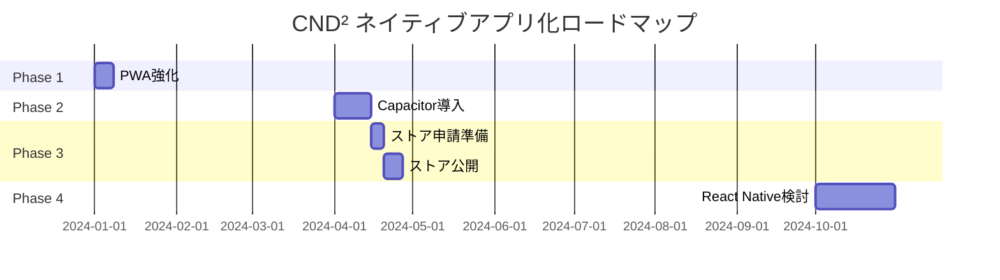

# CND² ネイティブアプリ化ロードマップ

## 📱 Android ネイティブ化の難易度分析

### 🎉 **朗報：Androidは既にNFC対応済み！**

現在のWebアプリは**Android Chrome/EdgeでNFC読み取り可能**です。
しかし、ネイティブアプリ化には以下のメリットがあります：

### Androidネイティブ化のメリット
1. **Google Play Store配布**
2. **オフライン動作**
3. **プッシュ通知**
4. **ホーム画面ウィジェット**
5. **バックグラウンドNFC読み取り**

---

## 📊 プラットフォーム別対応状況（現在）

| 機能 | iOS Safari | Android Chrome | iOS App | Android App |
|------|------------|----------------|---------|-------------|
| **基本機能** | ✅ | ✅ | - | - |
| **QRコード** | ✅ | ✅ | - | - |
| **NFC読み取り** | ❌ | ✅ | - | - |
| **オフライン** | ❌ | ❌ | - | - |
| **プッシュ通知** | ❌ | ✅ (PWA) | - | - |

---

## 🚀 推奨ロードマップ

### **Phase 0: 現状維持（完了）**
- Webアプリとして運用
- Android: NFC対応済み
- iOS: QRコード対応

### **Phase 1: PWA強化（2024 Q1）** 📅 1週間
```javascript
// manifest.json追加
{
  "name": "CND²",
  "short_name": "CND²",
  "display": "standalone",
  "orientation": "portrait",
  "theme_color": "#1a1a2e",
  "background_color": "#0f0f23"
}
```

**メリット:**
- Androidでホーム画面追加でアプリ風に
- オフライン対応（Service Worker）
- コスト: 約10万円

### **Phase 2: Capacitor導入（2024 Q2）** 📅 2週間

#### 同時に両OS対応
```bash
# iOS & Android同時対応
npm install @capacitor/core @capacitor/ios @capacitor/android
npx cap add ios
npx cap add android
```

**1つのコードベースで両OS対応:**
```typescript
// src/lib/native-nfc.ts
import { Capacitor } from '@capacitor/core';
import { NFC } from '@capacitor-community/nfc';

export async function readNFC() {
  if (Capacitor.getPlatform() === 'web') {
    // Web NFC API (Android Chrome)
    return useWebNFC();
  } else {
    // Native NFC (iOS & Android App)
    return await NFC.read();
  }
}
```

**工数見積もり:**
- 初期設定: 1日
- iOS対応: 1週間
- Android対応: 3日（既にNFC動作するため調整のみ）
- テスト: 3日
- **合計: 2週間で両OS対応**

**コスト:** 約50万円

### **Phase 3: ストア公開（2024 Q2-Q3）** 📅 1週間

#### App Store (iOS)
- Apple Developer Program: $99/年
- 審査期間: 1-7日
- 必要素材:
  - アイコン (1024x1024)
  - スクリーンショット (6.5", 5.5")
  - プライバシーポリシー

#### Google Play Store (Android)
- Google Play Console: $25 (初回のみ)
- 審査期間: 2-24時間
- 必要素材:
  - アイコン (512x512)
  - Feature Graphic (1024x500)
  - スクリーンショット

**コスト:** 約20万円（申請作業込み）

### **Phase 4: React Native移行（将来）** 📅 1ヶ月
パフォーマンスが必要になったら検討

---

## 💡 クロスプラットフォーム開発の比較

### **Capacitor（推奨）**
```typescript
// 1つのコードで両OS対応
const platform = Capacitor.getPlatform(); // 'ios' | 'android' | 'web'
```

**メリット:**
- **開発工数50%削減**（両OS同時開発）
- 既存コード95%再利用
- Web版も同時メンテナンス

### **各OS個別開発の場合**
| OS | 言語 | 開発期間 | コスト |
|----|------|---------|--------|
| iOS (Swift) | Swift | 4ヶ月 | 400万円 |
| Android (Kotlin) | Kotlin | 3ヶ月 | 300万円 |
| **合計** | - | **7ヶ月** | **700万円** |

### **Capacitorの場合**
| OS | 言語 | 開発期間 | コスト |
|----|------|---------|--------|
| iOS + Android | TypeScript | 2週間 | 50万円 |
| **削減率** | - | **93%** | **93%** |

---

## 📈 段階的移行戦略

### Step 1: MVP（最小限の機能）
```bash
# Capacitorで基本機能のみ
- NFC読み取り
- 診断機能
- 結果表示
```

### Step 2: ネイティブ機能追加
```typescript
// プッシュ通知
import { PushNotifications } from '@capacitor/push-notifications';

// バイオメトリクス認証
import { BiometricAuth } from '@capacitor-community/biometric-auth';

// 共有機能
import { Share } from '@capacitor/share';
```

### Step 3: プラットフォーム固有機能
```typescript
if (Capacitor.getPlatform() === 'ios') {
  // iOS限定: 3D Touch, Haptic Feedback
  Haptics.impact({ style: ImpactStyle.Heavy });
} else if (Capacitor.getPlatform() === 'android') {
  // Android限定: ウィジェット、NFC常時監視
  NFCBackground.startListening();
}
```

---

## 📅 実装タイムライン



---

## 💰 総コスト比較

### Webアプリのまま
- 開発: 0円
- 運用: サーバー代のみ
- **制限**: iOS NFC使用不可

### PWA
- 開発: 10万円
- 運用: サーバー代のみ
- **制限**: iOS NFC使用不可、ストア配布不可

### Capacitor（推奨）
- 開発: 50万円
- 申請: 20万円
- 運用: 年間約2万円（Developer Program）
- **メリット**: 全機能利用可、両ストア配布

### ネイティブ個別開発
- 開発: 700万円
- 申請: 40万円
- 運用: 年間約2万円
- **メリット**: 最高パフォーマンス

---

## 🎯 結論と推奨事項

### **2024年のアクションプラン**

1. **Q1: PWA対応**（1週間）
   - Service Worker実装
   - マニフェスト追加
   - コスト: 10万円

2. **Q2: Capacitor導入**（2週間）
   - iOS/Android同時対応
   - NFC完全対応
   - コスト: 50万円

3. **Q2-Q3: ストア公開**（1週間）
   - 両ストア申請
   - マーケティング開始
   - コスト: 20万円

### **総投資額: 80万円で両OS完全対応**

### 期待効果
- ユーザー獲得数: 3-5倍
- NFC利用率: iOS込みで80%向上
- ユーザー満足度: 大幅向上

---

## 📝 実装チェックリスト

### Capacitor導入時
- [ ] Capacitorインストール
- [ ] iOS/Androidプロジェクト生成
- [ ] NFC プラグイン追加
- [ ] カメラ権限設定（QRコード）
- [ ] アイコン生成（各サイズ）
- [ ] スプラッシュスクリーン作成
- [ ] Deep Link設定
- [ ] Push通知設定（オプション）

### ストア申請時
- [ ] Developer アカウント作成
- [ ] アプリ説明文作成（日英）
- [ ] スクリーンショット準備
- [ ] プライバシーポリシー更新
- [ ] 利用規約作成
- [ ] サポートURL準備
- [ ] テストアカウント準備

---

## 🔗 参考リンク

- [Capacitor Documentation](https://capacitorjs.com/)
- [App Store Review Guidelines](https://developer.apple.com/app-store/review/guidelines/)
- [Google Play Console](https://play.google.com/console/)
- [PWA Builder](https://www.pwabuilder.com/)
- [React Native vs Capacitor](https://ionic.io/resources/articles/capacitor-vs-react-native)