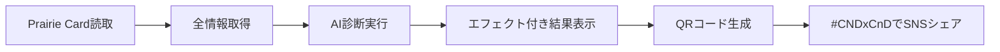

# CloudNative Days Winter 2025 CND²（CND Squared）企画書
## 〜 出会いを二乗でスケールする相性診断アプリ 〜

---

## 1. エグゼクティブサマリー

### 企画概要
CloudNative Days Winter 2025（CNDW2025）において、参加者同士の交流を楽しく促進する「**CND²（CND Squared）**」を提供します。Prairie Cardのプロフィール情報を最大限活用し、エンターテイメント性の高い診断で技術的な共通点や会話のきっかけを生成し、「Scaling Together」のテーマを二乗で体現します。

**アプリ名の意味：**
- **CND²** = CloudNative Days × Connect 'n' Discover
- 出会いと発見を指数関数的にスケール
- ハッシュタグ：**#CNDxCnD**

### 期待される効果
- **参加者満足度向上**: 500名以上が楽しい体験を通じて新しい出会いを獲得
- **コミュニティ活性化**: エンターテイメント要素で自然に会話が始まる仕組み
- **ブランド価値向上**: 革新的で楽しい交流促進でイベントの差別化

### 投資対効果
- **開発コスト**: ¥25,000（ボランティアベース、ドメイン費用不要）
- **期待リターン**: 参加者満足度向上、SNS露出増、話題性創出

---

## 2. 背景と課題

### イベントテーマ「Scaling Together」への貢献
CNDW2025のテーマは「Scaling Together」- 個人の技術力、組織の開発力、コミュニティの可能性をともにスケールすることです。**CND²**は、まさに「出会いを二乗でスケール」することで、このテーマを完璧に実現します。

### 解決する課題
1. **初対面の壁**: エンジニアは技術の話なら盛り上がれるが、最初の一歩が難しい
2. **共通点の発見**: 1000人規模のイベントで相性の良い人を見つけるのは困難
3. **交流の楽しさ不足**: 従来の名刺交換では味気ない、楽しい要素が欲しい

### Prairie Card活用の革新性
Prairie Cardに記載されている豊富な情報を最大限活用：
- **基本情報**: 名前、肩書き、所属、自己紹介文（全文）
- **技術プロファイル**: スキル、認定資格、技術スタック
- **活動情報**: SNSリンク、コミュニティ活動、技術発信
- **パーソナル情報**: 趣味、興味、モットー
- **カスタムフィールド**: その他の独自情報

これらの詳細情報により、より精度が高く、楽しい診断結果を提供します。

---

## 3. サービス詳細

### 3.1 機能概要

#### 必須機能（すべて実装）
- **Prairie Card読み取り**: URL手動入力、NFC読み取り、QRコード読み取り
- **相性診断**: 2〜6名での診断に対応
- **グループ診断**: 3人以上のチーム診断機能
- **結果保存・共有**: QRコード生成、7日間の結果保存
- **エンターテイメント診断**: Cloud Native用語を使った楽しい診断

#### エンターテイメント要素
- **ビジュアルエフェクト**: アニメーション背景、パーティクル効果
- **インタラクション**: グラスモーフィズムUI、ホバーエフェクト
- **診断演出**: スコアメーターアニメーション、結果表示エフェクト
- **共有機能**: コンフェッティ演出、SNSシェア機能（#CNDxCnD）

### 3.2 診断の流れ



### 3.3 診断結果例

#### 2人診断（エンターテイメント版）
```yaml
相性タイプ: "⚡ Horizontal Pod Autoscaler型 ⚡"
相性スコア: 92/100（アニメーション表示）
診断メッセージ: |
  お二人の関係は、負荷に応じて自動的にスケールする理想的な関係性！
  GitHubでの活発な活動とQiitaでの技術発信という共通点が、
  まさに「Scaling Together²」を体現しています。
  趣味のサウナとコーヒーという意外な共通点も発見！

会話のきっかけ:
  1. "GitHubで最近pushしたリポジトリの自慢ポイントは？"
  2. "Qiitaで一番バズった記事のテーマを教えてください"
  3. "サウナでKubernetesのアーキテクチャ考えたことあります？"

隠れた共通点: 
  "実は二人ともVimユーザー！エディタ戦争で同じ陣営です"

シェア用タグ: #CNDxCnD #CNDW2025
```

#### グループ診断（3-6人）
```yaml
相性タイプ: "☸️ Perfect Kubernetes Cluster型 ☸️"
グループスコア: 88/100（メーター表示）
役割分析:
  - Control Plane役: 全体をまとめるリーダータイプ（田中さん）
  - Worker Node役: 実装を支える実務家タイプ（佐藤さん、鈴木さん）
  - etcd役: 知識を保持する博識タイプ（山田さん）
  - Ingress Controller役: 外部との架け橋（高橋さん）

グループアクティビティ提案:
  - "🎮 Cloud Native人狼ゲーム - Podが落ちたのは誰のせい？"
  - "🏆 推しCNCFプロジェクトプレゼン大会"
  - "🍺 障害対応あるある飲み会"

特別な発見:
  "全員がGo言語経験者！Gopherの集いを開催できます"

シェア用: #CNDxCnD でつながったチーム！
```

---

## 4. 実装仕様

### 4.1 技術スタック
- **フロントエンド**: Next.js 14, TypeScript, Tailwind CSS, Framer Motion
- **3Dエフェクト**: Three.js
- **バックエンド**: Cloudflare Workers
- **AI**: OpenAI GPT-4o-mini
- **インフラ**: Cloudflare Pages, Workers KV
- **その他**: QRコード生成、NFC読み取り対応

### 4.2 ドメイン設定
```yaml
開発環境:
  URL: https://dev.tsukaman.com/cnd2
  用途: 開発・テスト
  
ステージング:
  URL: https://cnd2-staging.pages.dev
  用途: 本番前テスト
  
本番環境:
  URL: https://cdn2.cloudnativedays.jp
  用途: CloudNative Days公式サブドメイン
  切替: 11月11日（本番1週間前）
```

### 4.3 プライバシー対応
- **シンプルな同意取得**: 初回起動時に説明文を表示
- **エンターテイメント性を損なわない**: 楽しい雰囲気のまま同意を取得
- **データ保持**: 7日後に自動削除
- **取得情報**: Prairie Cardの公開情報のみ（全情報活用）

---

## 5. 開発スケジュール

### タイムライン（2025年8月24日〜11月19日）

| フェーズ | 期間 | 主要タスク |
|---------|------|------------|
| **Phase 1: 基盤構築** | 8/24-9/7 | 環境構築、Prairie Card全情報パーサー、基本UI |
| **Phase 2: エンタメ実装** | 9/8-9/21 | エンターテイメントUI、アニメーション、エフェクト |
| **Phase 3: コア機能** | 9/22-10/12 | AI診断、NFC/QR、グループ診断 |
| **Phase 4: 品質向上** | 10/13-10/31 | テスト、プロンプト調整、UI改善 |
| **Phase 5: 本番準備** | 11/1-11/17 | 本番環境構築、ドメイン切替、最終確認 |
| **本番稼働** | 11/18-19 | CNDW2025での運用 |

### マイルストーン
- **9月7日**: 基本機能完成
- **9月21日**: エンターテイメント要素実装完了
- **10月31日**: 全機能テスト完了
- **11月11日**: 本番ドメイン切替（cdn2.cloudnativedays.jp）
- **11月17日**: 本番リリース

---

## 6. 必要なリソース

### 6.1 イベント主催者側で必要な対応

| 項目 | 内容 | 時期 |
|------|------|------|
| **事前告知** | 公式サイト、SNSでの告知（#CNDxCnD） | 11月上旬 |
| **Prairie Card案内** | 参加者への事前作成依頼 | 11月上旬 |
| **会場対応** | 安定したWi-Fi環境の確保 | 当日 |
| **当日案内** | 受付での簡単な説明、QRコード掲示 | 当日 |
| **ドメイン提供** | cdn2.cloudnativedays.jpのサブドメイン | 11月11日 |
| **費用負担** | なし（完全ボランティア） | - |

### 6.2 開発・運用体制

- **開発**: ボランティアエンジニア 1-2名
- **費用**: ¥25,000（API費用等、個人/コミュニティ負担）
- **運用**: イベント期間中のリモート監視
- **サポート**: 基本的にセルフサービス（楽しいFAQ準備）

---

## 7. コスト詳細

### 7.1 予算内訳（¥25,000）

| 項目 | 金額 | 備考 |
|------|------|------|
| **本番AI API費用** | ¥8,000 | 1,200回の診断想定 |
| **開発・テスト用API** | ¥12,000 | エンタメ要素開発含む |
| **インフラ費用** | ¥0 | Cloudflare無料枠 |
| **ドメイン費用** | ¥0 | CloudNative Days公式サブドメイン |
| **予備費** | ¥5,000 | 緊急対応用 |
| **合計** | **¥25,000** | - |

### 7.2 負荷想定（現実的）
```yaml
利用パターン:
  通常時（セッション中）:
    - 同時接続: 10-20人
    - 段階的な利用
    
  休憩時間:
    - 同時接続: 50人程度
    - 自然な分散
    
  ピーク時（ランチ）:
    - 同時接続: 最大100人
    - キャッシュで対応

備考: イベント内の一企画のため、急激な一斉アクセスは発生しにくい
```

---

## 8. 期待される効果とKPI

### 8.1 定量的目標

| KPI | 目標値 | 測定方法 |
|-----|--------|----------|
| **利用者数** | 500名（50%） | アクセスログ |
| **診断回数** | 1,500回 | API呼び出し数 |
| **平均診断回数** | 3回/人 | 診断回数÷利用者数 |
| **Prairie Card活用度** | 80% | 全情報取得率 |
| **エンタメ満足度** | 90% | アンケート |
| **SNSシェア率** | 40% | #CNDxCnDタグ数 |

### 8.2 定性的効果

- **楽しい体験の提供**: エンターテイメント要素による記憶に残る体験
- **交流の活性化**: 診断結果を話題にした自然な会話
- **イベントの話題性**: #CNDxCnDでの拡散、次回への期待
- **コミュニティの結束**: 「楽しかった」という共通体験

---

## 9. リスク管理

### 9.1 想定されるリスクと対策

| リスク | 影響度 | 発生確率 | 対策 |
|--------|--------|---------|------|
| **ネットワーク障害** | 高 | 低 | オフライン時のエラー画面、再実行案内 |
| **想定以上のアクセス** | 中 | 低 | 段階的利用により自然に分散 |
| **Prairie Card仕様変更** | 中 | 低 | 柔軟なパーサー実装 |
| **AI API障害** | 高 | 低 | 再実行を促すメッセージ表示 |
| **エンタメ要素の不具合** | 低 | 中 | グレースフルデグラデーション |

### 9.2 段階的利用による自然な負荷分散
```yaml
イベント構造による分散:
  - セッション中: 参加者は講演に集中
  - 休憩時間: 徐々に利用開始
  - ランチタイム: ピークだが段階的
  - 展示ブース: 分散して利用
  
結果: 急激なピークが発生しにくい構造
```

---

## 10. 成功要因

### 10.1 技術面
- **Prairie Card全情報活用**: 詳細な情報による精度の高い診断
- **エンターテイメント性**: 楽しいUI/UXで利用促進
- **シンプルな実装**: 複雑な機能は避け、確実に動作する設計

### 10.2 運用面
- **段階的利用**: 自然な負荷分散
- **楽しい体験**: エラー時も前向きなメッセージ
- **Prairie Card配慮**: サーバー負荷の最小化

### 10.3 コミュニケーション
- **主催者との連携**: 定期的な進捗共有
- **参加者への案内**: 楽しさが伝わる説明
- **SNS活用**: #CNDxCnDでの拡散促進

---

## 11. 今後の展開

### 11.1 次回イベントでの改善
- CloudNative Days Summer 2025での機能拡張
- フィードバックを基にしたエンタメ要素強化
- より高度な診断アルゴリズム

### 11.2 他イベントへの展開
- 他地域のCloudNative Days
- 技術カンファレンス全般
- 企業内イベント

### 11.3 長期ビジョン
- 通年サービス化
- エンタープライズ版の開発
- グローバル展開

---

## 12. まとめ

**CND²（CND Squared）**は、CloudNative Days Winter 2025のテーマ「Scaling Together」を二乗で体現し、参加者同士の交流を楽しく促進する革新的な取り組みです。

**3つの価値提供**
1. **参加者への価値**: 楽しい体験と新しい出会いを二乗でスケール
2. **イベントへの価値**: 差別化と満足度向上
3. **コミュニティへの価値**: 記憶に残る共通体験

最小限のコスト（¥25,000）で最大限の楽しさを生み出し、CloudNative Daysを忘れられない体験にします。

**キャッチフレーズ：**
「CND × CnD = Your Connection²」
「出会いを二乗でスケールする」

---

## 13. デモ・プレビュー

### UI/UXプレビュー
```
[デモ動画URL]
[スクリーンショット]
[プロトタイプURL]
```

### 診断結果サンプル
- 2人診断の実例
- グループ診断の実例
- エンターテイメント要素の動作例
- #CNDxCnDでのシェア例

---

## 14. 連絡先

**プロジェクトリーダー**
- 担当: つかまん
- Prairie Card: https://my.prairie.cards/u/tsukaman
- メール: tsukaman@mac.com

**緊急連絡先**
- 技術サポート: tsukaman@mac.com
- 当日対応: [電話番号]

---

*本企画は、CloudNative Daysコミュニティの有志により、完全ボランティアで提供されます。*
*「Scaling Together²」の精神で、楽しくともに成長するコミュニティを実現します。*
*#CNDxCnD*