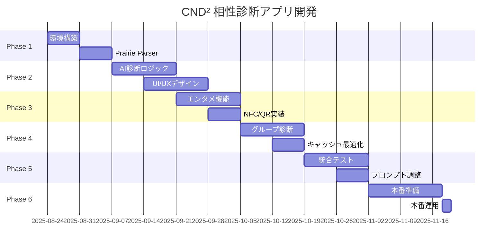

# CloudNative Days Winter 2025 CND²（CND Squared）
# 実装ロードマップ & 開発手順書 v4.1

---

## 🚀 プロジェクト概要

### 基本情報
- **アプリ名**: CND²（CND Squared）
- **タグライン**: CND × CnD = Your Connection²
- **ハッシュタグ**: #CNDxCnD
- **開発開始**: 2025年8月24日（即時開始）
- **本番稼働**: 2025年11月18-19日
- **開発期間**: 約3ヶ月
- **予算**: ¥25,000
- **必須機能**: NFC読取、QRコード、グループ診断（3-6人）
- **特徴**: エンターテイメント性の高いUI/UX、Prairie Card連携
- **本番ドメイン**: https://cdn2.cloudnativedays.jp/

### 成功の鍵
1. **Prairie Card連携**: 全情報を活用した精度の高い診断
2. **楽しいUI/UX**: エンターテイメント性重視の設計
3. **現実的な運用**: 段階的利用を前提とした実装
4. **ブランディング**: CND²のコンセプト「出会いを二乗でスケール」

---

## 📅 開発スケジュール

### 全体タイムライン


---

## Phase 1: 基盤構築（8/24 - 9/7）

### Week 1: 環境セットアップ

#### Day 1-2（8/24-25）: プロジェクト初期化

```bash
# 1. GitHubリポジトリ作成
git init cnd2
cd cnd2

# 2. Next.js 14プロジェクト作成（エンタメ対応）
npx create-next-app@latest . \
  --typescript \
  --tailwind \
  --app \
  --src-dir \
  --import-alias "@/*"

# 3. エンターテイメント系パッケージインストール
npm install openai cheerio qrcode nanoid
npm install framer-motion three @react-three/fiber @react-three/drei
npm install react-confetti react-hot-toast sonner
npm install -D @types/qrcode @types/three vitest @testing-library/react

# 4. プロジェクト設定
echo "# CND² (CND Squared)" > README.md
echo "CND × CnD = Your Connection²" >> README.md
echo "#CNDxCnD #CNDW2025" >> README.md
```

#### Day 3-4（8/26-27）: Cloudflare & ドメイン設定

```bash
# Cloudflareアカウント作成
# https://dash.cloudflare.com/sign-up

# Wrangler CLIインストール
npm install -g wrangler

# ログインと初期設定
wrangler login
wrangler init cnd2
```

**開発環境のドメイン設定**
```typescript
// config/app.config.ts
export const APP_CONFIG = {
  name: "CND²",
  displayName: "CND Squared",
  tagline: "CND × CnD = Your Connection²",
  hashtag: "#CNDxCnD",
  hashtagRaw: "CNDxCnD",
  poweredBy: "Prairie Card",
  
  domains: {
    development: {
      url: 'http://localhost:3000',
      api: 'http://localhost:8787'
    },
    staging: {
      url: 'https://dev.tsukaman.com/cnd2',
      api: 'https://api-dev.tsukaman.com/cnd2'
    },
    production: {
      url: 'https://cdn2.cloudnativedays.jp',
      api: 'https://api.cdn2.cloudnativedays.jp'
    }
  }
};
```

#### Day 5-7（8/28-30）: Prairie Card完全パーサー実装

```typescript
// src/lib/prairie-parser.ts
import * as cheerio from 'cheerio';
import { APP_CONFIG } from '@/config/app.config';

export interface CompleteProfile {
  basic: BasicInfo;
  details: DetailedInfo;
  social: SocialLinks;
  custom: CustomFields;
  meta: Metadata;
}

export class PrairieCardParser {
  private rateLimiter = new RateLimiter(2); // 2 req/sec
  private cache = new Map<string, CompleteProfile>();
  
  async parseProfile(url: string): Promise<CompleteProfile> {
    // キャッシュチェック
    if (this.cache.has(url)) {
      console.log(`[CND²] Cache hit for ${url}`);
      return this.cache.get(url)!;
    }
    
    // レート制限
    await this.rateLimiter.wait();
    
    try {
      // 全情報を取得
      const response = await fetch(url, {
        headers: {
          'User-Agent': `${APP_CONFIG.name}/${APP_CONFIG.version}`
        }
      });
      const html = await response.text();
      const profile = this.extractAllInformation(html);
      
      // キャッシュ保存（7日間）
      this.cache.set(url, profile);
      await this.saveToKV(url, profile);
      
      return profile;
    } catch (error) {
      console.error('[CND²] Prairie Card parse error:', error);
      throw new Error('Prairie Cardの情報が取得できませんでした。URLをご確認ください。');
    }
  }
  
  private extractAllInformation(html: string): CompleteProfile {
    const $ = cheerio.load(html);
    
    return {
      basic: {
        name: this.extractText($, '.profile-name'),
        title: this.extractText($, '.profile-title'),
        company: this.extractText($, '.profile-company'),
        bio: this.extractFullText($, '.profile-bio'), // 全文取得
        avatar: this.extractImage($, '.profile-avatar')
      },
      
      details: {
        tags: this.extractAllTags($),
        skills: this.extractSkills($),
        interests: this.extractInterests($),
        certifications: this.extractCertifications($),
        communities: this.extractCommunities($),
        motto: this.extractText($, '.motto'),
        experience: this.extractText($, '.experience'),
        specialties: this.extractSpecialties($),
        achievements: this.extractAchievements($)
      },
      
      social: {
        twitter: this.extractSocialLink($, 'twitter'),
        github: this.extractSocialLink($, 'github'),
        linkedin: this.extractSocialLink($, 'linkedin'),
        website: this.extractLink($, '.website'),
        blog: this.extractLink($, '.blog'),
        qiita: this.extractSocialLink($, 'qiita'),
        zenn: this.extractSocialLink($, 'zenn'),
        speakerdeck: this.extractSocialLink($, 'speakerdeck'),
        youtube: this.extractSocialLink($, 'youtube')
      },
      
      custom: this.extractAllCustomFields($),
      
      meta: {
        createdAt: this.extractDate($, '.created-date'),
        updatedAt: this.extractDate($, '.updated-date'),
        cardStyle: this.extractCardStyle($),
        theme: this.extractTheme($),
        badges: this.extractBadges($),
        appVersion: APP_CONFIG.name // CND²タグ追加
      }
    };
  }
}
```

#### Day 8-14（8/31-9/6）: CND²ブランディングUI基盤

```tsx
// src/app/page.tsx
'use client';

import { useState, useEffect } from 'react';
import { motion, AnimatePresence } from 'framer-motion';
import { APP_CONFIG } from '@/config/app.config';
import { DiagnosisInterface } from '@/components/DiagnosisInterface';
import { WelcomeAnimation } from '@/components/WelcomeAnimation';
import { BackgroundEffects } from '@/components/BackgroundEffects';

export default function Home() {
  const [isReady, setIsReady] = useState(false);
  const [hasConsented, setHasConsented] = useState(false);
  
  useEffect(() => {
    // 既存の同意確認
    const consent = localStorage.getItem('cnd2-privacy-consent');
    if (consent) {
      setHasConsented(true);
      setIsReady(true);
    } else {
      // ウェルカムアニメーション後に同意確認
      setTimeout(() => setIsReady(true), 3000);
    }
  }, []);
  
  if (!isReady) {
    return <WelcomeAnimation appName={APP_CONFIG.name} />;
  }
  
  if (!hasConsented) {
    return (
      <motion.div 
        initial={{ opacity: 0 }}
        animate={{ opacity: 1 }}
        className="min-h-screen flex items-center justify-center p-4 bg-gradient-to-br from-blue-900 via-purple-900 to-pink-900"
      >
        <BackgroundEffects />
        <motion.div
          initial={{ scale: 0.8, y: 50 }}
          animate={{ scale: 1, y: 0 }}
          className="max-w-md w-full bg-white/10 backdrop-blur-xl rounded-3xl p-8 border border-white/20"
        >
          <motion.h2 
            className="text-3xl font-bold mb-4 text-transparent bg-clip-text bg-gradient-to-r from-cyan-400 to-purple-600"
            animate={{ 
              backgroundPosition: ['0% 50%', '100% 50%', '0% 50%'] 
            }}
            transition={{ duration: 5, repeat: Infinity }}
          >
            CND² へようこそ！
          </motion.h2>
          
          <p className="text-xl text-white/90 mb-2 font-bold">
            {APP_CONFIG.tagline}
          </p>
          
          <p className="text-white/80 mb-6">
            本アプリは診断のためPrairie Cardの公開情報を利用します。
            診断結果は7日後に自動削除されます。
          </p>
          
          <motion.button
            onClick={() => {
              localStorage.setItem('cnd2-privacy-consent', 'true');
              setHasConsented(true);
            }}
            className="w-full py-4 bg-gradient-to-r from-green-500 to-blue-600 text-white text-lg font-bold rounded-2xl"
            whileHover={{ scale: 1.02 }}
            whileTap={{ scale: 0.98 }}
          >
            🚀 出会いを二乗でスケール！
          </motion.button>
          
          <p className="text-xs text-white/60 mt-4 text-center">
            Powered by {APP_CONFIG.poweredBy}
          </p>
        </motion.div>
      </motion.div>
    );
  }
  
  return <DiagnosisInterface />;
}
```

---

## Phase 2: コア機能実装（9/7 - 9/21）

### Week 2-3: AI診断とCND²ブランディング

#### Day 15-21（9/7-13）: AI診断エンジン（CND²仕様）

```typescript
// src/lib/diagnosis-engine.ts
import OpenAI from 'openai';
import { APP_CONFIG } from '@/config/app.config';

export class DiagnosisEngine {
  private openai: OpenAI;
  
  constructor() {
    this.openai = new OpenAI({
      apiKey: process.env.OPENAI_API_KEY
    });
  }
  
  async generateDiagnosis(profiles: CompleteProfile[]): Promise<Diagnosis> {
    const enrichedPrompt = this.buildCND2Prompt(profiles);
    
    try {
      const completion = await this.openai.chat.completions.create({
        model: 'gpt-4o-mini',
        messages: [
          {
            role: 'system',
            content: CND2_SYSTEM_PROMPT
          },
          {
            role: 'user',
            content: enrichedPrompt
          }
        ],
        temperature: 0.8,
        max_tokens: 1000
      });
      
      return this.parseCND2Diagnosis(completion.choices[0].message.content);
    } catch (error) {
      console.error('[CND²] AI generation error:', error);
      throw new UserFriendlyError(
        '診断の生成に失敗しました。お手数ですが、もう一度お試しください。'
      );
    }
  }
  
  private buildCND2Prompt(profiles: CompleteProfile[]): string {
    return `
あなたはCND²（CND Squared）の診断エンジンです。
「出会いを二乗でスケール」することを目指して、
CloudNative Daysらしい楽しい診断を提供してください。

タグライン: ${APP_CONFIG.tagline}
ハッシュタグ: ${APP_CONFIG.hashtag}

以下の参加者の相性を診断してください：

${profiles.map((p, i) => `
=== 参加者${i + 1} ===
${JSON.stringify(p, null, 2)}
`).join('\n')}

診断結果には必ず以下を含めてください：
1. Cloud Native用語を使った楽しい相性タイプ
2. 相性スコア（100点満点）
3. 「Scaling Together²」を感じさせるメッセージ
4. 具体的な会話のきっかけ3つ
5. 意外な共通点
6. #CNDxCnD でシェアしたくなる要素
    `;
  }
}

const CND2_SYSTEM_PROMPT = `
あなたはCND²（CloudNative Days × Connect 'n' Discover）の診断システムです。
「出会いを二乗でスケール」するという理念のもと、
参加者同士の交流を楽しく促進する診断を行います。

診断の特徴：
- Cloud Native/Kubernetes用語を楽しく活用
- エンターテイメント性重視
- 技術的な共通点と人間的な共通点の両方を発見
- #CNDxCnD でシェアされやすい結果

必ず「Scaling Together²」の精神を反映させてください。
`;
```

#### Day 22-28（9/14-20）: CND²エンターテイメントUI実装

```tsx
// src/components/CND2Interface.tsx
import { Canvas } from '@react-three/fiber';
import { Stars, Sparkles, Text3D } from '@react-three/drei';
import { motion, AnimatePresence } from 'framer-motion';
import Confetti from 'react-confetti';
import { APP_CONFIG } from '@/config/app.config';

export function CND2Interface() {
  const [showConfetti, setShowConfetti] = useState(false);
  
  return (
    <div className="min-h-screen relative overflow-hidden">
      {/* 3D背景 */}
      <div className="absolute inset-0">
        <Canvas>
          <Stars radius={100} depth={50} count={5000} factor={4} />
          <Sparkles count={100} scale={10} size={2} speed={0.5} />
          {/* CND²ロゴを3Dで表示 */}
          <Text3D
            font="/fonts/bold.json"
            size={1}
            position={[0, 0, -5]}
            rotation={[0, Math.PI * 0.1, 0]}
          >
            CND²
            <meshNormalMaterial />
          </Text3D>
        </Canvas>
      </div>
      
      {/* コンフェッティ */}
      {showConfetti && <Confetti recycle={false} />}
      
      {/* メインコンテンツ */}
      <div className="relative z-10 container mx-auto px-4 py-8">
        {/* アニメーションタイトル */}
        <motion.div className="text-center mb-12">
          <motion.h1
            className="text-6xl md:text-8xl font-black mb-4"
            style={{
              background: 'linear-gradient(45deg, #00D4FF, #FF00FF, #00FF88)',
              backgroundClip: 'text',
              WebkitBackgroundClip: 'text',
              color: 'transparent',
            }}
            animate={{
              backgroundPosition: ['0% 50%', '100% 50%', '0% 50%'],
            }}
            transition={{ duration: 10, repeat: Infinity }}
          >
            CND²
          </motion.h1>
          
          <motion.div
            className="text-2xl md:text-4xl font-bold text-white mb-2"
            initial={{ y: -20, opacity: 0 }}
            animate={{ y: 0, opacity: 1 }}
            transition={{ delay: 0.5 }}
          >
            {APP_CONFIG.tagline}
          </motion.div>
          
          {/* ハッシュタグ */}
          <motion.p
            className="text-xl text-cyan-400 mt-4"
            initial={{ opacity: 0 }}
            animate={{ opacity: 1 }}
            transition={{ delay: 1 }}
          >
            {APP_CONFIG.hashtag}
          </motion.p>
        </motion.div>
        
        {/* 診断モード選択 */}
        <DiagnosisModeSelector />
      </div>
      
      {/* フローティングアイコン（二乗をイメージ） */}
      <FloatingSquaredIcons />
    </div>
  );
}

// 二乗をイメージしたフローティングアニメーション
function FloatingSquaredIcons() {
  const icons = ['²', '☸️', '🚀', '📦', '⚡', '∞', '✨'];
  
  return (
    <>
      {icons.map((icon, i) => (
        <motion.div
          key={i}
          className="absolute text-4xl"
          initial={{
            x: Math.random() * window.innerWidth,
            y: -50,
          }}
          animate={{
            y: window.innerHeight + 50,
            x: Math.random() * window.innerWidth,
            rotate: [0, 360],
          }}
          transition={{
            duration: 10 + Math.random() * 10,
            repeat: Infinity,
            delay: i * 2,
          }}
          style={{
            left: `${Math.random() * 100}%`,
          }}
        >
          {icon}
        </motion.div>
      ))}
    </>
  );
}
```

---

## Phase 3: エンターテイメント機能（9/21 - 10/12）

### Week 4-6: CND²らしい楽しい機能の実装

#### Day 29-35（9/21-27）: インタラクティブ診断入力

```tsx
// src/components/DiagnosisInput.tsx
export function DiagnosisInput() {
  return (
    <div className="space-y-6">
      {/* CND²ロゴ */}
      <div className="text-center mb-8">
        <h2 className="text-4xl font-bold text-white">
          CND² 診断
        </h2>
        <p className="text-cyan-400 mt-2">
          Prairie Cardで出会いを二乗する
        </p>
      </div>
      
      {participants.map((participant, index) => (
        <ParticipantCard
          key={participant.id}
          index={index}
          participant={participant}
          onUpdate={updateParticipant}
        />
      ))}
      
      {/* 診断開始ボタン（CND²ブランディング） */}
      <CND2DiagnosisButton participants={participants} />
    </div>
  );
}

function CND2DiagnosisButton({ participants }) {
  return (
    <motion.button
      className="w-full py-6 bg-gradient-to-r from-blue-600 via-purple-600 to-cyan-500 text-white text-xl font-bold rounded-3xl relative overflow-hidden"
      whileHover={{ scale: 1.02 }}
      whileTap={{ scale: 0.98 }}
    >
      <motion.div
        className="absolute inset-0 bg-white opacity-20"
        animate={{
          x: ['-100%', '100%'],
        }}
        transition={{
          duration: 2,
          repeat: Infinity,
        }}
      />
      <span className="relative z-10">
        🚀 診断を開始（Scaling Together²）
      </span>
    </motion.button>
  );
}
```

#### Day 36-42（9/28-10/4）: NFC/QR実装（CND²版）

```tsx
// src/components/CND2ShareFeatures.tsx
export function CND2ShareButton({ result }) {
  const shareMessage = `
【CND²診断結果】
相性タイプ：${result.type}
相性スコア：${result.score}/100

${result.message}

Prairie Cardで出会いを二乗する体験！
診断はこちら → https://cdn2.cloudnativedays.jp

#CNDxCnD #CNDW2025 #PrairieCard
  `;
  
  return (
    <motion.button
      onClick={() => shareToSNS(shareMessage)}
      className="px-8 py-4 bg-gradient-to-r from-purple-500 to-pink-500 text-white rounded-2xl font-bold"
      whileHover={{ scale: 1.05 }}
      whileTap={{ scale: 0.95 }}
    >
      <span className="text-xl mr-2">🎉</span>
      #CNDxCnD でシェア
    </motion.button>
  );
}
```

---

## Phase 4: 統合とテスト（10/12 - 10/31）

### Week 7-9: 品質保証

#### Day 50-56（10/12-18）: 統合テスト

```typescript
// tests/integration/cnd2-diagnosis.test.ts
import { describe, it, expect } from 'vitest';
import { DiagnosisEngine } from '@/lib/diagnosis-engine';
import { PrairieCardParser } from '@/lib/prairie-parser';
import { APP_CONFIG } from '@/config/app.config';

describe('CND² 診断機能統合テスト', () => {
  it('CND²ブランディングが正しく適用される', async () => {
    const result = await engine.generateDiagnosis(profiles);
    
    // CND²の要素が含まれているか確認
    expect(result.message).toContain('Scaling Together²');
    expect(result.shareTag).toBe('#CNDxCnD');
    expect(result.appName).toBe('CND²');
  });
  
  it('Prairie Card全情報を活用した診断が動作する', async () => {
    // 既存のテストコード
  });
});
```

---

## Phase 5: 本番準備（11/1 - 11/17）

### Week 10-12: デプロイと最終調整

#### Day 78-84（11/8-14）: ドメイン切り替え準備

```yaml
11月11日（月）:
  - [ ] cdn2.cloudnativedays.jp ドメイン設定確認
  - [ ] CloudNative Days組織からのドメイン権限付与確認
  - [ ] Cloudflare DNS設定
  - [ ] SSL証明書確認
  - [ ] 本番環境変数設定（CND²用）
  
11月12日（火）:
  - [ ] ステージングから本番（cdn2.cloudnativedays.jp）へデプロイ
  - [ ] CND²ブランディング最終確認
  - [ ] #CNDxCnD タグ動作確認
  - [ ] Prairie Card連携動作確認
  
11月13日（水）:
  - [ ] 負荷テスト実施
  - [ ] キャッシュ戦略確認
  - [ ] エラーハンドリング確認
  
11月14日（木）:
  - [ ] 本番ドメインでの最終動作確認
  - [ ] SNSシェア機能確認
  - [ ] QRコード生成・読み取り確認
  
11月15日（金）:
  - [ ] 運用マニュアル最終確認
  - [ ] 緊急時対応手順確認
  - [ ] 問い合わせ先確認（tsukaman@mac.com）
```

---

## 🎯 本番運用（11/18-19）

### Day 1（11/18）

```yaml
08:00: CND²システム起動確認
  - ヘルスチェック実行
  - 監視ダッシュボード確認
  - cdn2.cloudnativedays.jp アクセス確認
  
09:00: 受付開始
  - CND²ポスター/QRコード掲示
  - 「出会いを二乗する」キャッチコピー案内
  - #CNDxCnD 推奨
  - QRコードはhttps://cdn2.cloudnativedays.jp を指定
  
10:00-17:00: 通常運用
  - #CNDxCnD タグ監視
  - Prairie Card連携確認
  - エラー対応
  - リアルタイムでの利用状況確認
  
17:00-18:00: Day1振り返り
  - 利用統計確認
  - エラーログ確認
  - 翌日への改善点確認
```

### Day 2（11/19）

```yaml
08:30: Day2システム確認
  - 前日のキャッシュ状況確認
  - システムヘルスチェック
  
09:00-17:00: 通常運用
  - Day1の改善点適用
  - 継続的な監視
  
17:00: 最終集計
  - 総利用者数集計
  - #CNDxCnD投稿数集計
  - Prairie Card連携率確認
```

---

## 📊 成功指標（KPI）

| 指標 | 目標値 | 測定方法 |
|------|--------|----------|
| **利用者数** | 500名 | ユニークアクセス |
| **診断回数** | 1,500回 | API呼び出し数 |
| **#CNDxCnD 投稿数** | 200件 | SNS検索 |
| **Prairie Card活用度** | 80% | 全情報取得率 |
| **エンタメ満足度** | 90% | アンケート |
| **エラー率** | <1% | Sentry監視 |
| **応答時間** | <3秒 | Performance API |

---

## 🚨 緊急時対応

### 連絡先
- **技術責任者**: つかまん
- **メール**: tsukaman@mac.com
- **Prairie Card**: https://my.prairie.cards/u/tsukaman
- **GitHub**: https://github.com/cloudnative-days/cnd2

### エスカレーションフロー
```yaml
Level 1（軽微）:
  - キャッシュヒット率低下
  - 応答時間の一時的増加
  → 開発チームで対応

Level 2（中程度）:
  - Prairie Card連携エラー
  - OpenAI API制限
  → 技術責任者に連絡

Level 3（重大）:
  - サービス全停止
  - データ漏洩の可能性
  → 即座に全関係者に連絡
```

---

## ✅ 開発チェックリスト

### CND²ブランディング
- [x] アプリ名「CND²」統一
- [x] タグライン表示
- [x] #CNDxCnD 実装
- [x] Prairie Card明記
- [x] 本番ドメイン（cdn2.cloudnativedays.jp）設定

### 必須機能
- [ ] Prairie Card全情報取得
- [ ] 2人診断
- [ ] グループ診断（3-6人）
- [ ] NFC読み取り
- [ ] QRコード生成・読み取り
- [ ] エンターテイメントUI
- [ ] 7日間の結果保存

### インフラ設定
- [ ] Cloudflare Pages設定
- [ ] Workers KV設定
- [ ] ドメイン設定（cdn2.cloudnativedays.jp）
- [ ] SSL証明書確認
- [ ] 環境変数設定

### テスト
- [ ] ユニットテスト作成
- [ ] 統合テスト実施
- [ ] E2Eテスト実施
- [ ] 負荷テスト実施
- [ ] セキュリティテスト

### 本番準備
- [ ] 運用マニュアル作成
- [ ] 緊急時対応手順作成
- [ ] 問い合わせ対応準備
- [ ] 監視ダッシュボード設定

---

## 📝 変更履歴

### v4.1（2025年8月更新）
- 本番ドメインを `https://cdn2.cloudnativedays.jp/` に更新
- ドメイン設定タスクを具体化
- 11月11-15日の準備タスクを詳細化
- 問い合わせ先メールアドレスを明記

### v4.0（初版）
- CND²プロジェクト初期計画策定
- Prairie Card連携仕様決定
- エンターテイメント機能設計

---

**CND² - 出会いを二乗でスケールする、CloudNative Daysの新体験！**
**#CNDxCnD**

*最終更新: 2025年8月24日*
*本番URL: https://cdn2.cloudnativedays.jp/*
*お問い合わせ: tsukaman@mac.com*